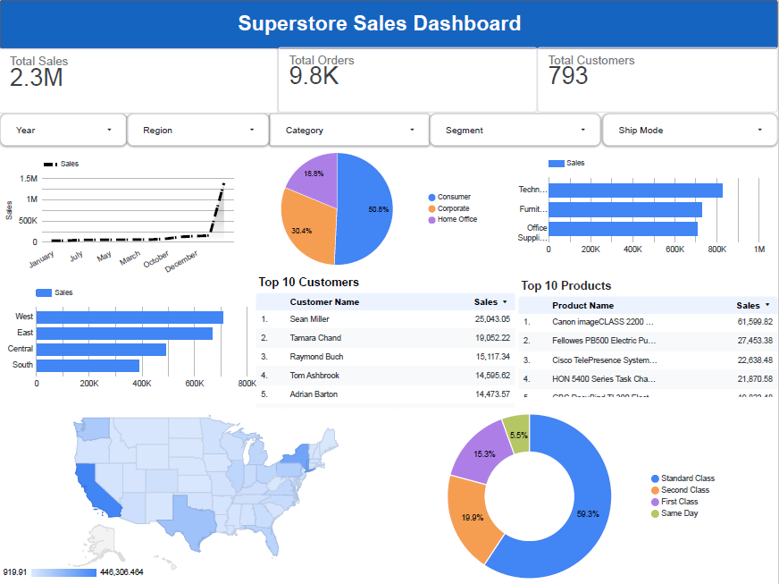

# 📊 Superstore Sales Analysis

An end-to-end **Sales Analytics** project that analyzes Superstore sales data using **Python** and visualizes business performance through both a **Python Dashboard** and an **Interactive Looker Studio Dashboard**.

This project demonstrates data cleaning, exploratory data analysis (EDA), feature engineering, visualization, and business insights that help understand sales trends, customer behavior, and regional performance.

---

# 🚀 Project Overview

The objective of this project is to analyze historical sales data to answer important business questions such as:

- Which regions generate the highest sales?
- Which product categories perform the best?
- Who are the top customers?
- Which products generate the most revenue?
- How do sales change over time?
- Which shipping modes are most frequently used?

The project includes two dashboards:

- 📈 Python Dashboard (Matplotlib)
- 🌐 Interactive Looker Studio Dashboard

---

# 🛠️ Tools & Technologies

- Python
- Pandas
- NumPy
- Matplotlib
- Jupyter Notebook
- Looker Studio
- CSV Dataset

---

# 📂 Project Structure

```
Superstore-Sales-Analysis/
│
├── dashboard/
│   ├── Dashboard_Pythonmade.png
│   ├── Looker_Studio_Dashboard.png
│   └── Superstore_Sales_Dashboard.pdf
│
├── data/
│   ├── Superstore_Sales_Dataset.csv
│   └── Superstore_Sales_Dataset_Clean.csv
│
├── images/
│   ├── (Individual visualization images)
│
├── notebooks/
│   └── Superstore_Sales_Analytics.ipynb
│
├── README.md
├── LICENSE
├── .gitignore
└── .gitattributes
```

---

# 📊 Python Dashboard

The Python dashboard includes:

- Sales by Region
- Sales by State
- Sales Trend Over Time
- Sales by Category
- Segment-wise Sales
- Monthly Orders
- Sales Distribution (Box Plot)
- Ship Mode Analysis
- Top 10 Customers

---

# 🌐 Looker Studio Dashboard

The interactive dashboard contains:

### KPI Cards

- Total Sales
- Total Orders
- Total Customers

### Interactive Filters

- Year
- Region
- Category
- Segment
- Ship Mode

### Visualizations

- Monthly Sales Trend
- Sales by Region
- Sales by Segment
- Top 10 Customers
- Top 10 Products
- Sales by State (Map)
- Ship Mode Distribution

---

# 📈 Key Insights

### 📌 East Region generated the highest sales.

The East region consistently outperformed all other regions, making it the strongest contributor to overall revenue.

---

### 📌 Consumer Segment contributed over half of total sales.

Consumer customers represented the largest customer segment, indicating strong retail demand.

---

### 📌 Standard Class was the most frequently used shipping mode.

Most customers preferred Standard Class, suggesting a balance between delivery cost and speed.

---

### 📌 Sales increased significantly during November and December.

The last quarter of the year recorded the highest sales, indicating strong seasonal demand.

---

### 📌 Technology products generated the highest revenue.

Technology was the best-performing category compared with Furniture and Office Supplies.

---

### 📌 A small group of customers contributed a large portion of revenue.

The Top 10 customers generated significantly higher sales than the average customer.

---

### 📌 California was the highest-performing state.

California consistently recorded the largest sales among all states.

---

# 💡 Business Recommendations

### ✅ Focus on the East Region

Increase inventory and marketing investment in the East region to maximize revenue.

---

### ✅ Promote Technology Products

Expand promotions and product offerings in the Technology category to capitalize on strong customer demand.

---

### ✅ Prepare for Peak Season

Increase stock levels and marketing campaigns before November and December to capture seasonal demand.

---

### ✅ Reward High-Value Customers

Introduce loyalty programs and personalized offers for top customers to improve customer retention.

---

### ✅ Improve Low-Performing Regions

Analyze customer preferences in lower-performing regions and create targeted marketing strategies.

---

### ✅ Optimize Shipping Operations

Since Standard Class is the most preferred shipping option, improving delivery efficiency can enhance customer satisfaction.

---

### ✅ Expand High-Performing Products

Increase inventory for best-selling products while reviewing underperforming products for potential improvements.

---

## 📊 Dashboard Preview

### Python Dashboard

[](dashboard/Superstore_Sales_Dashboard.pdf)

---

### Looker Studio Dashboard


---

# 📚 Learning Outcomes

Through this project, I gained practical experience in:

- Data Cleaning
- Feature Engineering
- Exploratory Data Analysis (EDA)
- Data Visualization
- Dashboard Design
- Business Insight Generation
- Looker Studio Reporting
- Python for Data Analytics

---

# 👤 Author

**Naved Khan**

GitHub:
https://github.com/NavedAnalytics

---

⭐ If you found this project useful, consider giving it a Star.